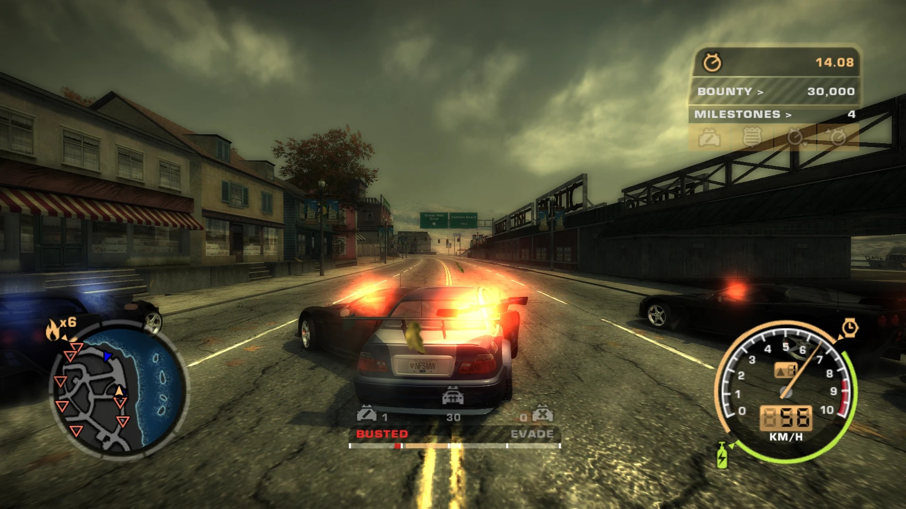

# NFSMW Fair Busts

**Reset your car and stop getting busted for it.**

An ASI plugin for Need for Speed: Most Wanted (2005, PC).

Reset your car during a pursuit and the game busts you almost immediately. That
is not the cops catching up — it is a penalty the game applies the moment you
hit reset, and once it starts there is nothing you can do to escape it. Drive
off at full speed and you still get busted.

This removes it. A reset costs you your speed and nothing else, so getting stuck
on scenery mid-chase is something you can actually recover from.



*Boxed in at heat 6 — the busted meter still has to earn it.*

## Requirements

- Need for Speed: Most Wanted (2005), PC, **version 1.3** — the 6,029,312 byte `speed.exe`
- An ASI loader — the usual `dinput8.dll` from [Ultimate ASI Loader](https://github.com/ThirteenAG/Ultimate-ASI-Loader)

A modified executable is fine. Large address aware, widescreen and no-CD patched
exes all work.

## Installing

1. Grab the latest zip from [Releases](../../releases).
2. Drop `NFSMWFairBusts.asi` and `NFSMWFairBusts.ini` into your game's `scripts`
   folder.
3. Launch the game.

No keys to press. It plays nicely alongside Unlimiter, Bartender, ExtraOptions,
Takedown N2O and the Widescreen Fix. To uninstall, delete the two files.

## Settings

Everything lives in `NFSMWFairBusts.ini`. Changes take effect next launch.

| Setting | Default | What it does |
| --- | --- | --- |
| `Enabled` | `1` | `0` turns the mod off and leaves the game as it was. |
| `ResetAutoBust` | `0` | The instant bust itself. At `0` a reset puts you back under the normal rules, so outrunning the cops still works. `1` is the stock behaviour, where the bust lands no matter what you do. |
| `ResetBustMultiplier` | `1.0` | How fast the busted meter climbs after a reset. `1.0` is the same as any other bust, `4.0` is what the game uses. Raise it if you want a reset to cost you something without being a guaranteed bust. |

The two reset settings are independent. Leaving `ResetAutoBust` at `0` and
setting `ResetBustMultiplier` to `2.0` gives you a reset that fills the meter
twice as fast but is still escapable, if you think a completely free reset is
too soft.

## Did it work?

After launching, look for `NFSMWFairBusts.log` in your `scripts` folder. It is
rewritten every launch and holds a single line:

```
Mod injected and applied to v1.3 and C0516B485065FABDD69579816B5DF763
```

That hash is whichever `speed.exe` you are running, so yours may well be
different — a patched exe reports its own, and that is normal.

If the mod did not load, the line says why instead. The two usual causes are a
game version other than 1.3, and another plugin having already modified the same
pursuit code.

## Building

Only needed if you want to compile it yourself. The game is 32-bit, so Win32 is
the only platform, and the CRT is linked statically so no VC++ redistributable
is required.

Visual Studio — open `NFSMWFairBusts.sln` and build Release|Win32, or:

```
msbuild NFSMWFairBusts.sln /p:Configuration=Release /p:Platform=Win32
```

MinGW — needs a 32-bit MinGW-w64 g++ (`i686-w64-mingw32`):

```
mingw32-make
```

or run `build.bat`.

## License

MIT — see [LICENSE](LICENSE).
